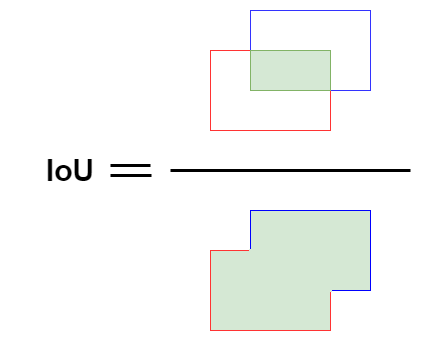
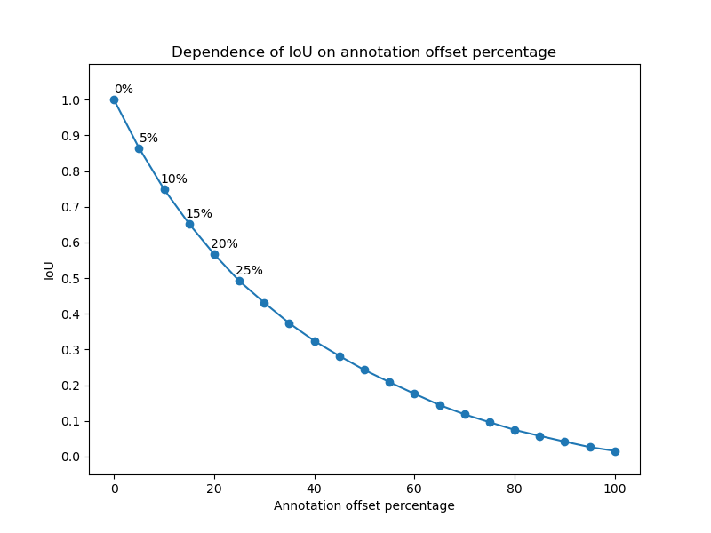
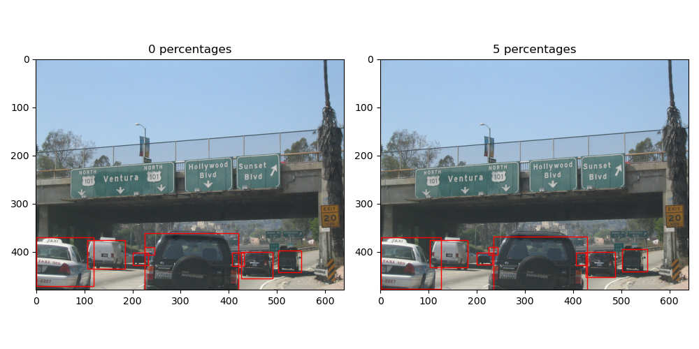
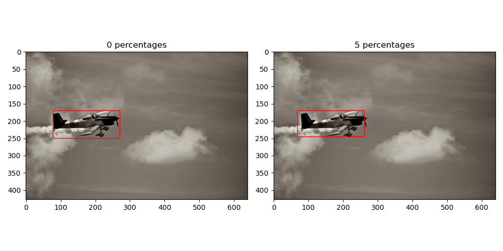
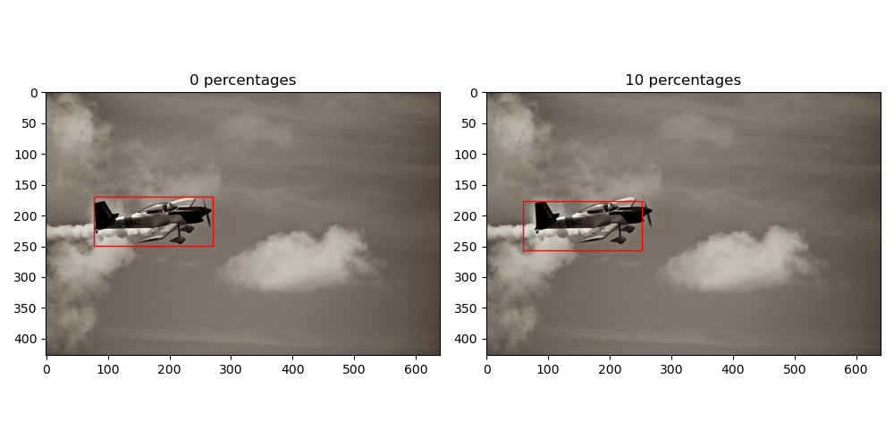
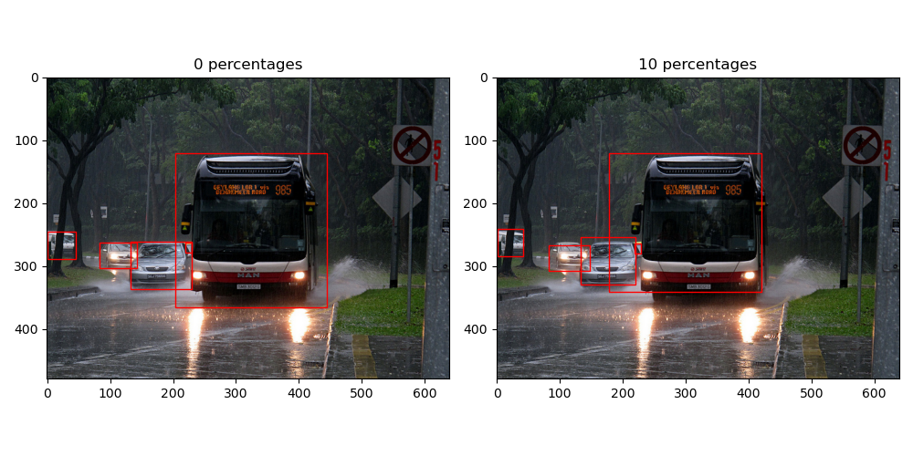
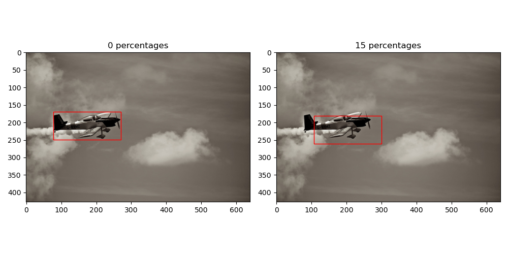
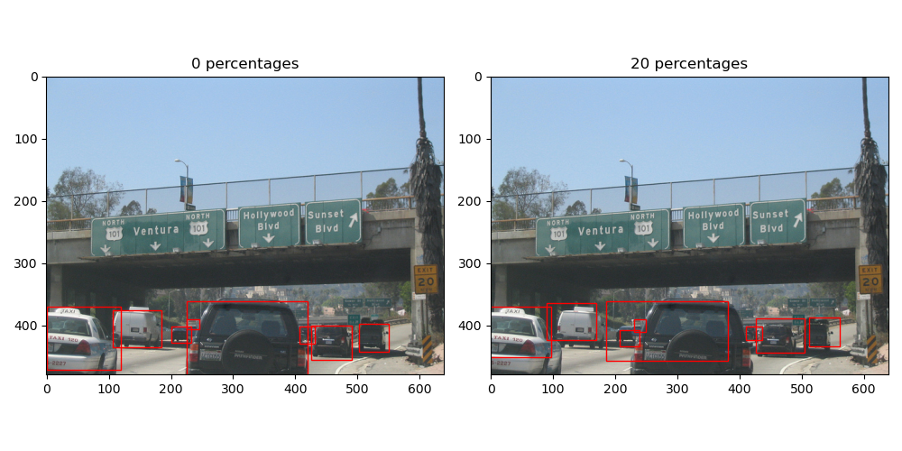
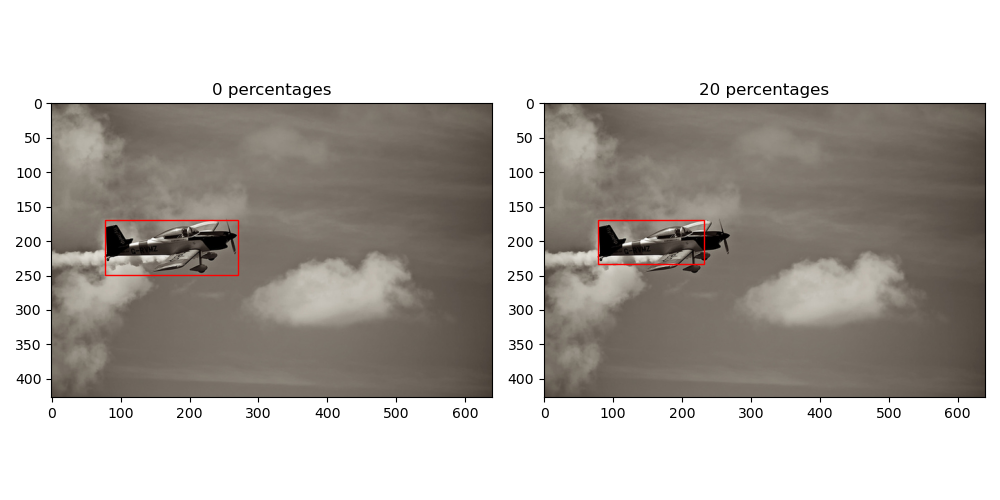
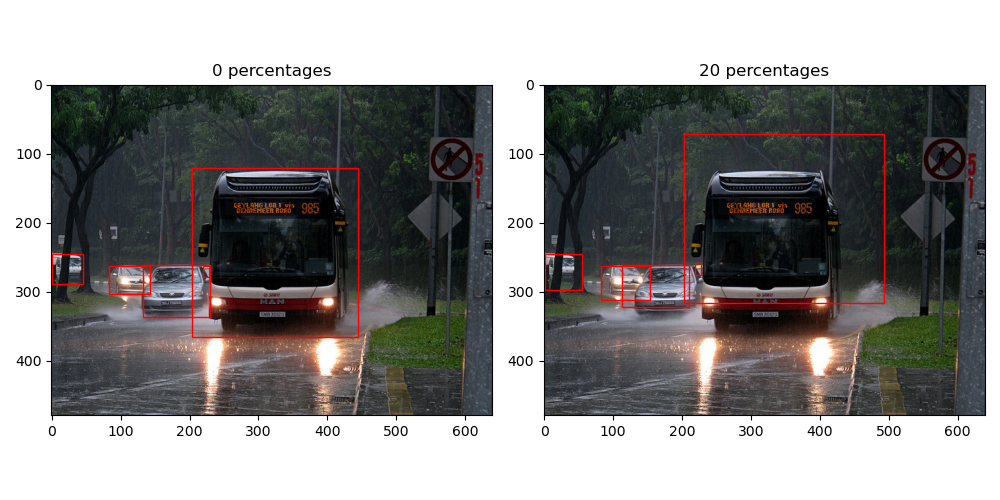

# IoU

### 1. What is IoU?
IoU - **Intersection over Union**. It is the ratio of the area of the intersection of two areas to the area of their union. IoU measures how much two rectangular areas in an image overlap.

### 2. Mathematical formula

$$ IoU = {\text{{area of intersection of regions A and B}} \over \text{{area of union of regions A and B}}} $$

 

### 3. IoU with coco images
I wanted to assess the optimal IoU threshold to determine whether to accept or reject the pre-annotations. Based on the IoU value, we can establish the machine learning model's threshold for generating annotations.

This is why I examined the IoU using both perfect COCO annotations and annotations with some errors. I introduced a random percentage error to the X and Y axes in all COCO images containing vehicles.
Here are the results:

As we can see, a larger error means a lower IoU. Some people say that an IoU of 0.7 is considered acceptable. Let's check it:

#### 5% error

#### 10% error

#### 15% error

#### 20% error

Of course, there is a random error, so sometimes it appears acceptable at 15% (as seen in the first image with cars) or 20% (as observed in the image with a plane). However, when we consider the average, the optimal error threshold falls between 10% and 15%, which corresponds to an IoU of 0.7.

For the safety and certainty of accurate pre-annotations, it is advisable to consider an appropriate 10% error threshold.
